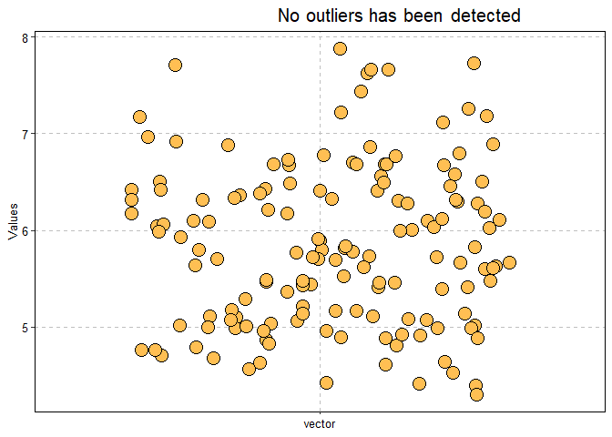

README
================
Edson Nilton de Moura SIlva Júnior
2023-06-07

# Dealing with outliers in R

Outliers can be defined by valeus or ammostraal units in a vector or
sample which are highlightly distinct from the others. They can be a
trouble to many statistics analysis, thus outliers affect them,
increasing the chances to occour Type 1 Error (reject null hypothesis
when it is true). Based this, detecting and knowing outliers in a
vector, such a variable, can be high usefull to data science.

# Required packages

To initialize the analysis, it is required the `tidyverse` package.

``` r
library(tidyverse)
```

# Dataset

To do the analyses, it will use the `Iris dataset`, a dataset containg
data about three species from *Iris* genera: *I. setosa*, *I.
versicolor*, and *I. virginica*. That dataset have data about their
sepal length and width, and petal length and width.

``` r
data("iris")

iris
```

    ##     Sepal.Length Sepal.Width Petal.Length
    ## 1            5.1         3.5          1.4
    ## 2            4.9         3.0          1.4
    ## 3            4.7         3.2          1.3
    ## 4            4.6         3.1          1.5
    ## 5            5.0         3.6          1.4
    ## 6            5.4         3.9          1.7
    ## 7            4.6         3.4          1.4
    ## 8            5.0         3.4          1.5
    ## 9            4.4         2.9          1.4
    ## 10           4.9         3.1          1.5
    ## 11           5.4         3.7          1.5
    ## 12           4.8         3.4          1.6
    ## 13           4.8         3.0          1.4
    ## 14           4.3         3.0          1.1
    ## 15           5.8         4.0          1.2
    ## 16           5.7         4.4          1.5
    ## 17           5.4         3.9          1.3
    ## 18           5.1         3.5          1.4
    ## 19           5.7         3.8          1.7
    ## 20           5.1         3.8          1.5
    ## 21           5.4         3.4          1.7
    ## 22           5.1         3.7          1.5
    ## 23           4.6         3.6          1.0
    ## 24           5.1         3.3          1.7
    ## 25           4.8         3.4          1.9
    ## 26           5.0         3.0          1.6
    ## 27           5.0         3.4          1.6
    ## 28           5.2         3.5          1.5
    ## 29           5.2         3.4          1.4
    ## 30           4.7         3.2          1.6
    ## 31           4.8         3.1          1.6
    ## 32           5.4         3.4          1.5
    ## 33           5.2         4.1          1.5
    ## 34           5.5         4.2          1.4
    ## 35           4.9         3.1          1.5
    ## 36           5.0         3.2          1.2
    ## 37           5.5         3.5          1.3
    ## 38           4.9         3.6          1.4
    ## 39           4.4         3.0          1.3
    ## 40           5.1         3.4          1.5
    ## 41           5.0         3.5          1.3
    ## 42           4.5         2.3          1.3
    ## 43           4.4         3.2          1.3
    ## 44           5.0         3.5          1.6
    ## 45           5.1         3.8          1.9
    ## 46           4.8         3.0          1.4
    ## 47           5.1         3.8          1.6
    ## 48           4.6         3.2          1.4
    ## 49           5.3         3.7          1.5
    ## 50           5.0         3.3          1.4
    ## 51           7.0         3.2          4.7
    ## 52           6.4         3.2          4.5
    ## 53           6.9         3.1          4.9
    ## 54           5.5         2.3          4.0
    ## 55           6.5         2.8          4.6
    ## 56           5.7         2.8          4.5
    ## 57           6.3         3.3          4.7
    ## 58           4.9         2.4          3.3
    ## 59           6.6         2.9          4.6
    ## 60           5.2         2.7          3.9
    ## 61           5.0         2.0          3.5
    ## 62           5.9         3.0          4.2
    ## 63           6.0         2.2          4.0
    ## 64           6.1         2.9          4.7
    ## 65           5.6         2.9          3.6
    ## 66           6.7         3.1          4.4
    ## 67           5.6         3.0          4.5
    ## 68           5.8         2.7          4.1
    ## 69           6.2         2.2          4.5
    ## 70           5.6         2.5          3.9
    ## 71           5.9         3.2          4.8
    ## 72           6.1         2.8          4.0
    ## 73           6.3         2.5          4.9
    ## 74           6.1         2.8          4.7
    ## 75           6.4         2.9          4.3
    ## 76           6.6         3.0          4.4
    ## 77           6.8         2.8          4.8
    ## 78           6.7         3.0          5.0
    ## 79           6.0         2.9          4.5
    ## 80           5.7         2.6          3.5
    ## 81           5.5         2.4          3.8
    ## 82           5.5         2.4          3.7
    ## 83           5.8         2.7          3.9
    ## 84           6.0         2.7          5.1
    ## 85           5.4         3.0          4.5
    ## 86           6.0         3.4          4.5
    ## 87           6.7         3.1          4.7
    ## 88           6.3         2.3          4.4
    ## 89           5.6         3.0          4.1
    ## 90           5.5         2.5          4.0
    ## 91           5.5         2.6          4.4
    ## 92           6.1         3.0          4.6
    ## 93           5.8         2.6          4.0
    ## 94           5.0         2.3          3.3
    ## 95           5.6         2.7          4.2
    ## 96           5.7         3.0          4.2
    ## 97           5.7         2.9          4.2
    ## 98           6.2         2.9          4.3
    ## 99           5.1         2.5          3.0
    ## 100          5.7         2.8          4.1
    ## 101          6.3         3.3          6.0
    ## 102          5.8         2.7          5.1
    ## 103          7.1         3.0          5.9
    ## 104          6.3         2.9          5.6
    ## 105          6.5         3.0          5.8
    ## 106          7.6         3.0          6.6
    ## 107          4.9         2.5          4.5
    ## 108          7.3         2.9          6.3
    ## 109          6.7         2.5          5.8
    ## 110          7.2         3.6          6.1
    ## 111          6.5         3.2          5.1
    ## 112          6.4         2.7          5.3
    ## 113          6.8         3.0          5.5
    ## 114          5.7         2.5          5.0
    ## 115          5.8         2.8          5.1
    ## 116          6.4         3.2          5.3
    ## 117          6.5         3.0          5.5
    ## 118          7.7         3.8          6.7
    ## 119          7.7         2.6          6.9
    ## 120          6.0         2.2          5.0
    ## 121          6.9         3.2          5.7
    ## 122          5.6         2.8          4.9
    ## 123          7.7         2.8          6.7
    ## 124          6.3         2.7          4.9
    ## 125          6.7         3.3          5.7
    ## 126          7.2         3.2          6.0
    ## 127          6.2         2.8          4.8
    ## 128          6.1         3.0          4.9
    ## 129          6.4         2.8          5.6
    ## 130          7.2         3.0          5.8
    ## 131          7.4         2.8          6.1
    ## 132          7.9         3.8          6.4
    ## 133          6.4         2.8          5.6
    ## 134          6.3         2.8          5.1
    ## 135          6.1         2.6          5.6
    ## 136          7.7         3.0          6.1
    ## 137          6.3         3.4          5.6
    ## 138          6.4         3.1          5.5
    ## 139          6.0         3.0          4.8
    ## 140          6.9         3.1          5.4
    ## 141          6.7         3.1          5.6
    ## 142          6.9         3.1          5.1
    ## 143          5.8         2.7          5.1
    ## 144          6.8         3.2          5.9
    ## 145          6.7         3.3          5.7
    ## 146          6.7         3.0          5.2
    ## 147          6.3         2.5          5.0
    ## 148          6.5         3.0          5.2
    ## 149          6.2         3.4          5.4
    ## 150          5.9         3.0          5.1
    ##     Petal.Width    Species
    ## 1           0.2     setosa
    ## 2           0.2     setosa
    ## 3           0.2     setosa
    ## 4           0.2     setosa
    ## 5           0.2     setosa
    ## 6           0.4     setosa
    ## 7           0.3     setosa
    ## 8           0.2     setosa
    ## 9           0.2     setosa
    ## 10          0.1     setosa
    ## 11          0.2     setosa
    ## 12          0.2     setosa
    ## 13          0.1     setosa
    ## 14          0.1     setosa
    ## 15          0.2     setosa
    ## 16          0.4     setosa
    ## 17          0.4     setosa
    ## 18          0.3     setosa
    ## 19          0.3     setosa
    ## 20          0.3     setosa
    ## 21          0.2     setosa
    ## 22          0.4     setosa
    ## 23          0.2     setosa
    ## 24          0.5     setosa
    ## 25          0.2     setosa
    ## 26          0.2     setosa
    ## 27          0.4     setosa
    ## 28          0.2     setosa
    ## 29          0.2     setosa
    ## 30          0.2     setosa
    ## 31          0.2     setosa
    ## 32          0.4     setosa
    ## 33          0.1     setosa
    ## 34          0.2     setosa
    ## 35          0.2     setosa
    ## 36          0.2     setosa
    ## 37          0.2     setosa
    ## 38          0.1     setosa
    ## 39          0.2     setosa
    ## 40          0.2     setosa
    ## 41          0.3     setosa
    ## 42          0.3     setosa
    ## 43          0.2     setosa
    ## 44          0.6     setosa
    ## 45          0.4     setosa
    ## 46          0.3     setosa
    ## 47          0.2     setosa
    ## 48          0.2     setosa
    ## 49          0.2     setosa
    ## 50          0.2     setosa
    ## 51          1.4 versicolor
    ## 52          1.5 versicolor
    ## 53          1.5 versicolor
    ## 54          1.3 versicolor
    ## 55          1.5 versicolor
    ## 56          1.3 versicolor
    ## 57          1.6 versicolor
    ## 58          1.0 versicolor
    ## 59          1.3 versicolor
    ## 60          1.4 versicolor
    ## 61          1.0 versicolor
    ## 62          1.5 versicolor
    ## 63          1.0 versicolor
    ## 64          1.4 versicolor
    ## 65          1.3 versicolor
    ## 66          1.4 versicolor
    ## 67          1.5 versicolor
    ## 68          1.0 versicolor
    ## 69          1.5 versicolor
    ## 70          1.1 versicolor
    ## 71          1.8 versicolor
    ## 72          1.3 versicolor
    ## 73          1.5 versicolor
    ## 74          1.2 versicolor
    ## 75          1.3 versicolor
    ## 76          1.4 versicolor
    ## 77          1.4 versicolor
    ## 78          1.7 versicolor
    ## 79          1.5 versicolor
    ## 80          1.0 versicolor
    ## 81          1.1 versicolor
    ## 82          1.0 versicolor
    ## 83          1.2 versicolor
    ## 84          1.6 versicolor
    ## 85          1.5 versicolor
    ## 86          1.6 versicolor
    ## 87          1.5 versicolor
    ## 88          1.3 versicolor
    ## 89          1.3 versicolor
    ## 90          1.3 versicolor
    ## 91          1.2 versicolor
    ## 92          1.4 versicolor
    ## 93          1.2 versicolor
    ## 94          1.0 versicolor
    ## 95          1.3 versicolor
    ## 96          1.2 versicolor
    ## 97          1.3 versicolor
    ## 98          1.3 versicolor
    ## 99          1.1 versicolor
    ## 100         1.3 versicolor
    ## 101         2.5  virginica
    ## 102         1.9  virginica
    ## 103         2.1  virginica
    ## 104         1.8  virginica
    ## 105         2.2  virginica
    ## 106         2.1  virginica
    ## 107         1.7  virginica
    ## 108         1.8  virginica
    ## 109         1.8  virginica
    ## 110         2.5  virginica
    ## 111         2.0  virginica
    ## 112         1.9  virginica
    ## 113         2.1  virginica
    ## 114         2.0  virginica
    ## 115         2.4  virginica
    ## 116         2.3  virginica
    ## 117         1.8  virginica
    ## 118         2.2  virginica
    ## 119         2.3  virginica
    ## 120         1.5  virginica
    ## 121         2.3  virginica
    ## 122         2.0  virginica
    ## 123         2.0  virginica
    ## 124         1.8  virginica
    ## 125         2.1  virginica
    ## 126         1.8  virginica
    ## 127         1.8  virginica
    ## 128         1.8  virginica
    ## 129         2.1  virginica
    ## 130         1.6  virginica
    ## 131         1.9  virginica
    ## 132         2.0  virginica
    ## 133         2.2  virginica
    ## 134         1.5  virginica
    ## 135         1.4  virginica
    ## 136         2.3  virginica
    ## 137         2.4  virginica
    ## 138         1.8  virginica
    ## 139         1.8  virginica
    ## 140         2.1  virginica
    ## 141         2.4  virginica
    ## 142         2.3  virginica
    ## 143         1.9  virginica
    ## 144         2.3  virginica
    ## 145         2.5  virginica
    ## 146         2.3  virginica
    ## 147         1.9  virginica
    ## 148         2.0  virginica
    ## 149         2.3  virginica
    ## 150         1.8  virginica

# Load functions

Three function was build to deal about outliers: `outlier_detect()`, to
detect the the presence of upper and lower outliers; `outlier_plot()`,
to plot the vector in a ggplot scatter plot, vizualizing their
distribuition; and `outlier_percent()`, to calculate the percentage of
upper and lower outlier in the vector. The fuctions were build and saved
in .R files. check them in repository files.

To load the functions, it was used the `source()` function to that three
.R files, containg the functions.

``` r
source("outlier detect.r")

source("outlier plot.r")

source("outlier percente.r")
```

# Detectig

``` r
for(i in iris[1:4] %>% names()){
  
  str_glue("# detecting outlier to {i}") %>% message()
  
  outlier_detect(iris[i] %>% pull()) 
  
  message(" ")
  
}
```

    ## # detecting outlier to Sepal.Length

    ## upper outlier: FALSE

    ## lower outlier: FALSE

    ## 

    ## # detecting outlier to Sepal.Width

    ## upper outlier: TRUE

    ## [1] 4.4 4.1 4.2

    ## lower outlier: TRUE

    ## [1] 2

    ## 

    ## # detecting outlier to Petal.Length

    ## upper outlier: FALSE

    ## lower outlier: FALSE

    ## 

    ## # detecting outlier to Petal.Width

    ## upper outlier: FALSE

    ## lower outlier: FALSE

    ## 

# Ploting

``` r
for(i in iris[1:4] %>% names()){
  
  str_glue("# plotting outlier to {i}") %>% message()
  
  outlier_plot(iris[i] %>% pull()) %>% print()
  
  message(" ")
  
}
```

    ## # plotting outlier to Sepal.Length

    ## 

    ## # plotting outlier to Sepal.Width

<!-- -->

    ## 

    ## # plotting outlier to Petal.Length

<!-- -->

    ## 

    ## # plotting outlier to Petal.Width

<!-- -->

    ## 

<!-- -->

# Percenatge

``` r
for(i in iris[1:4] %>% names()){
  
  str_glue("# Percentage outlier to {i}") %>% message()
  
  outlier_percent(iris[i] %>% pull())
  
  message(" ")
  
}
```

    ## # Percentage outlier to Sepal.Length

    ## No outliers has been detected

    ## 

    ## # Percentage outlier to Sepal.Width

    ## percentage of upper oultiers values count by vector count

    ## 2%

    ## percentage of lower oultiers values count by vector count

    ## 0.666666666666667%

    ## 

    ## # Percentage outlier to Petal.Length

    ## No outliers has been detected

    ## 

    ## # Percentage outlier to Petal.Width

    ## No outliers has been detected

    ## 
